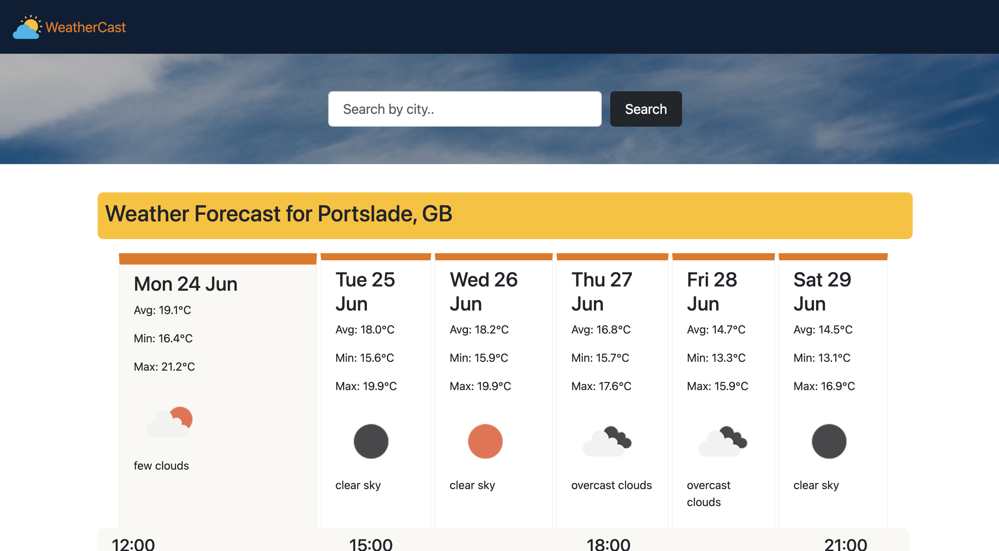

# weathercast

Welcome to WeatherCast, a weather application created with JavaScript. WeatherCast offers a user-friendly interface to check real-time weather conditions and forecasts for any location in the world.

Go to github page : https://vilmaglynn.github.io/weathercast/

## Features

Real-Time Weather Data: Get current weather information for any city or location.
5-Day Forecast: Plan ahead with a detailed 5-day weather forecast.
Interactive UI: Easy-to-use interface with dynamic visuals.
Location Search: Find weather data for any location by simply entering the city name or using geolocation.
Responsive Design: Works seamlessly on desktops, tablets, and mobile devices.

## Technologies Used

JavaScript: Core functionality and logic.
HTML5 & CSS3: Structure and styling of the application.
API Integration: Fetching weather data from a weather API (e.g., OpenWeatherMap).
GitHub Pages: Hosting the application

## Acknowledgements

Thanks to OpenWeatherMap for providing the weather data API.
Icons and other assets are credited to their respective creators.
Contact

For any questions or suggestions, feel free to reach out:

GitHub: [vilmaglynn](https://github.com/vilmaglynn)
Email: vilmaglynn@hotmail.com
